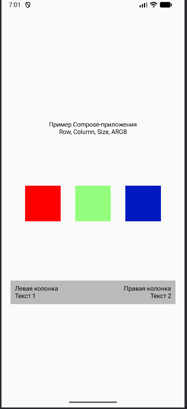

# Лабораторная работа №5
### Тема: Jetpack Compose: контейнеры, ARGB-модель и Material Design
#### Цель работы: Повторить основы разработки пользовательского интерфейса на Jetpack Compose, работу с контейнерами Row и Column, познакомиться с ARGBмоделью цветов, компонентом Scaffold и принципами Material Design
#### Описание приложения: 
Приложение — демонстрационный пример работы с Jetpack Compose (фреймворк для создания UI в Android‑приложениях). Оно показывает использование базовых компонуемых элементов (composables) и их модификаторов для построения интерфейса.
Основные блоки интерфейса
Экран разделён на три вертикальные секции с помощью Column и Box (с распределением пространства через weight(1f)):
##### Верхняя секция: заголовок (```TitleBlock```)
Содержит два текстовых элемента:
«Пример Compose‑приложения» (основной заголовок).
«Row, Column, Size, ARGB» (подзаголовок).
Выравнивание — по центру по горизонтали.

##### Средняя секция: ряд цветных блоков (```ColorRow```)

Реализована через ```Row``` с равномерным распределением элементов (Arrangement.SpaceEvenly).
Внутри — три блока (ColorBox), каждый размером 80 dp×80 dp.
Цвета блоков:
Красный: ```Color(0xFFFF0000)``` (непрозрачный).
Зелёный с прозрачностью: ```Color(0x802FFF00)``` (50% прозрачности, формат ARGB).
Синий: ```Color(0xFF001AC0)``` (непрозрачный).

##### Нижняя секция: комбинированный блок (```CombineBlock```)

Фон блока — светло‑серый (Color(0xFFBBBABA)).
Внутри блока — ```Row```, делящая пространство между двумя колонками (```Column```):
Левая колонка:
Заголовок «Левая колонка».
Дополнительный текст «Текст 1».
Выравнивание текста — по левому краю.
Правая колонка:
Заголовок «Правая колонка».
Дополнительный текст «Текст 2».
Выравнивание текста — по правому краю.
Элементы разделены отступами (padding).

#### Скриншот результата:
